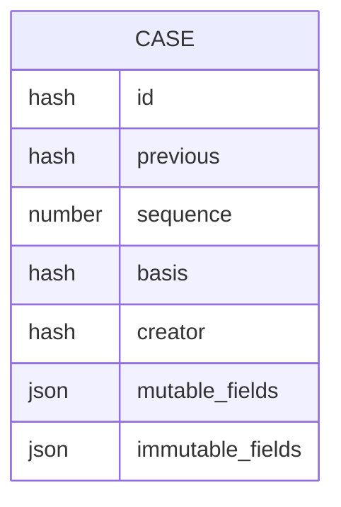
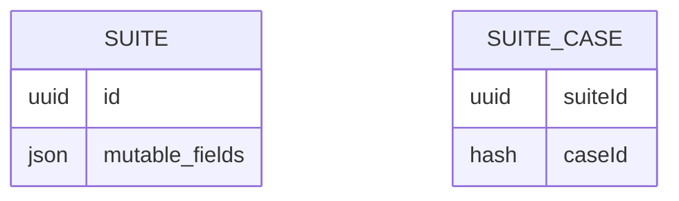
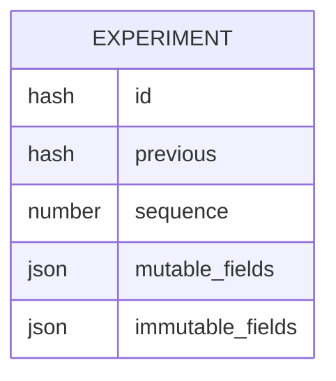
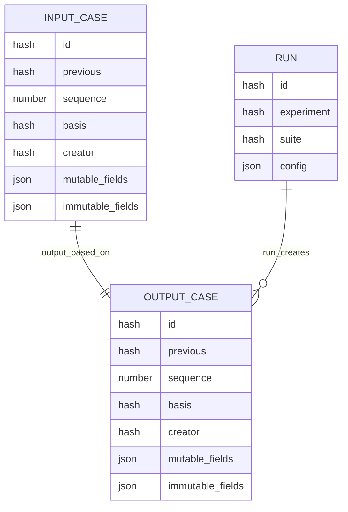

# GoTaglio Data Model

This document explains the design intent behind the GoTaglio data model.
We begin with a number of motivating scenarios and then describe the entities at a higher level
before moving on to implementation considerations and a formal database schema.

As you read this, keep in mind that the overarching goal is to accelerate and formalize
the processes of the applied science inner loop by the organization and recombination
of data assets relating to training and evaluation cases and the results of experiments.

Goals include fluidity in manipulating, annotating, and recombining
data while providing the foundation for an automatic
journal of experimental results.

## Scenarios

At this point it may help to examine a common multi-step
workflow that involves a number of different types of cases.

Consider a team that is building an LLM-based ordering bot
for a coffee shop. In each session, the customer will start
out with an empty cart, and ask the bot to put various drinks
and pastries into the cart.

Here is one workflow the team might use to develop this bot:

- **Crowd source orders** from members of the team. The orders would initially be _results_ of a process that entered the orders - perhaps from a web app, or more likely from importing a spreadsheet. Note that at this point, the orders aren't paired with expected shopping carts.
- **Categorize and prioritize orders.** The crowd-sourced orders are likely of varying quality with skewed distributions. Program management may work with the team to categorize the orders by scenario and feasibility and then prioritize the categories according to business needs. This can be considered a second experiment, whose _results_ contain the categories and priorities.
- **Add expected carts.** At this point, the team might select a subset of high priority orders that are also feasible and begin an effort to label each with an expected shopping cart. This labelling process may be done manuallly or perhaps with a more powerful LLM than will be used in production. It is also possible that the labelling process will be a hybrid, where the LLM guesses the cart and then a human corrects it. The output of this process is a set of _results_ that can be combined with the initial cases to make evaluation cases that contain the user order and the expected cart.
- **Add observed behavior.** Now the team can uses these cases as the basis for an evaluation suite that first generates _results_ that contain the LLM response.
- **Evaluate a run.** These results can then be used to drive an evaluation process that uses human judges, or perhaps another LLM to determine how well that observed answer matches the expected answer.

Each step of this workflow involves

1. selecting from some join of existing _cases_ and _results_ to form a new set of _cases_.
2. running an _experiment_ on this new set of _cases_ to produce a new set of _results_. Some experiments, like capturing LLM output are fully automated, while others, like prioritization, triaging, and performing evaluation likely have a human in the loop. These human-in-the-loop operations may be directed by a web-based labelling system, or they may involve a more manual process of exporting records as csv, annotating in a spreadsheet, and importing the resulting records.

## Five Gotaglio Entities

At a high level, the GoTaglio data model is based on five entity types. They are the _experiment_, _run_, _result_, _case_, and _suite_. Because the output of one experiment often serves as the input to another, at a practical level, the _result_ and _case_ entity types differ only in generic parameterization, and can share an implementation. We will see in the [Implementation Considerations](#implementation-considerations) section that _case_ and _result_ are one in the same.

### Experiment

An _experiment_ defines the semantics of an operation to be performed. One can perform an experiment by providing a set of input cases and configuration details such as versions of software libraries and models, and the values of specific configuration options. The result of performing the experiment is a _run_ entity.

While the term, _experiment_, implies a hypothesis-driven inquiry, in GoTaglio, the term applies more broadly to a repeatable process for generating ouput records.

Typically each ouput record is an annotation of a corresponding input record, however in some scenarios, like importing data from a file, the _result_ may stand on its own with no corresponding input _case_.

Here are some example experiments:

- **Perform LLM inference**, using a prompt derived from each input case.
- **Collect human labels** for each (user input, agent response) tuple.
- **Have another LLM score the results** of the initial LLM
- **Assign project management labels** such are priority levels or scenario names.
- **Import new cases into the system.** An example might be a quality control system that collects photos of items on an assembly line, along with operator accept/reject labels. Another example would be a voice ordering system that collects audio recordings paired with cash register tapes.

### Run

A _run_ documents the configuration details and the _results_ of conducting a specific experiment at a point in time.

Each _run_ is associated with a specific _experiment_, a _suite_ of input _cases_, and a collection _result_ records.

In theory, the _run_ contains sufficient information to allow one to replicate the _experiment_. This includes configuration details and the set of immutable input cases.

### Result

The output of a _run_ is a set of _results_, where each _result_ is associated with at most one input _case_. One can think of an output as the return value of a function, defined by the _experiment_, which takes a _case_ as input.

Examples include:

- Generate a prompt from an input _case_, perform LLM inference, and return the LLM output
- a web application that presents an input _case_ to a human who provides a label, which is returned in the output.

Note that in some experiments, the result may stand on its own with no corresponding input _case_. Think of this as a function with no parameters.

Examples include:

- A function that generates random numbers.
- An LLM that generates random text.
- A system that collects assembly line photos and quality assurance assessments from an external system.

### Case

The _case_ provides the input to the _experiment_ function which produces a _result_. A typical _case_ for evaluating a system might pair an input with an expected output. Note,
however, that cases often support scenarios other than
evaluation, and these cases might not contain the expected output.

As mentioned earlier, the _result_ and _case_ entity types differ only in generic parameterization, and can share an implementation. 
This is important because the output of one experiment often serves as the input to another.

### Suite

The _suite_ represents a collection of _cases_.

## Design Intent

The design goal that _runs_ can always be reproduced implies that the _cases_ that serve as inputs to the _run_ must be preserved. One approach would be to store the _cases_ inside of the _run_.

While this would ensure that the cases would be available in perpetuity, it makes it hard to do longitudinal queries of results involving certain cases across time. As an example, there might be a product release gate experiment and the team would like to get a query of the most unreliable cases over time.

One way to facilitate these queries is to make _cases_ first
class citizens that are incorporated by reference. To do this we must ensure the cases are *immutable*.

An additional consideration is that we expect that cases will be shared around an organization and be incorporated into multiple, potentially unrelated, databases. This suggests that local mechanisms that enfore global immutability in unrelated systems are important.

### Immutability

One way to enforce immutability is to use a cryptographic hash of certain fields as the primary key. It may be that non-semantic fields, like the title, keywords, author, and priority are not hashed, but semantic fields like the user order and expected cart are hashed.

Cryptographic hashes have the beneficial property of local policy implementation with global reach across unrelated systems.

A downside of hashes as primary keys is performance - both in creating the hashes and indexing them. We don't expect that GoTaglio databases will every be big enough for the performance hit to be problematic. Also, we expect that teams will continuously curate and filter cases and will migrate the useful cases to new database instances on a regular basis.

Perhaps the biggest challenge of immutability is that there are many valid reasons to modify cases in small ways.

### Provenance Chains

Over time it is common for teams to discover that there are errors in their _cases_. There may be inadvertant typos or perhaps unicode characters from the wrong code page. As these cases are discovered we need some way to fix them, while also retaining information to assist in comparing results from before and after the fix.

If we enforce the constraint that the primary key is always the cryptographic hash of the _case_, we will find that the any edit will need to create a new record.

We'd certainly like utility functions that would replace instances of edited _cases_ in suites with their new versions, but we also need some way of understanding that this has happened.

Suppose we have an immutable _run_, R, which is based on immutable cases A, B, and C. We've discovered an error in case A, which we've repaired by creating A'. We then used the utility function to create R', which is based on A', B, and C.

Now we might want to compare R' with R. To do this, it would help to know how R' was derived from R, that this will lead us to the question of how A' was derived from A.

One solution is to maintain a provenance chain within each record. The provenance field is either null, for the first instance of a record, or it is the hash/primary key of the record it was derived from.

The provenance field allows us to track the chain of edits, and a simple record diff algorithm can explain the edits along the chain.


## Implementation Considerations

At the database level, the GoTaglio data model consists of just four entity types. They are the _case_, _suite_, _experiment_, and _run_.

### Case

The _case_ is the central data record type in GoTaglio. While its name is meant to evoke the concept of a "test case", containing inputs and expected outputs, it can also be used to hold user annotation fields such as priority levels and quality judgements It can also store data like a record read from a CSV file or the output of an LLM.

Cases are made up of a combination of mutable and immutable fields. Typically fields like a title or description are mutable, while semantic fields like input values and observed outputs are immutable. In GoTaglio, immutability is achieved by setting the primary key of a record to be the [BLAKE2b](<https://en.wikipedia.org/wiki/BLAKE_(hash_function)#BLAKE2>) hash of its immutable fields.

_Cases_ maintain a provenance chain by storing the id of the unedited version in the `previous` field. The `previous` field can be null if the _case_ is the first instance.

_Cases_ maintain an integer `sequence` number field that is equal to the length of the provenance chain. The sequence number can be used in database queries to select the first and last version of a set of _cases_ that share the same `creator` and `basis` value.

All _cases_ are the output of some _run_. The id of the _run_ associated with the creation of a _case_ is stored in the case's `creator` field.

In many scenarios, the _run_ produces each output _case_ by transforming a corresponding input case. An example _run_ might pull a user prompt from an input _case_, feed it to an LLM and record the inferred response in the output _case_. A run might also be created by an interactive web app that prompts human judges to supply labels for input _cases_. In these scenarios, where the output _case_ is a function of a corresponding input _case_, the `basis` field will be set to the id of the input _case_.

In some scenarios, there is no input _case_. An example would be a run that creates _cases_ corresponding to rows in a CSV file. In this situation, the `basis field` will be null.

Note that the four hash fields - the `id`, `previous`, `basis`, and `creator` fields are managed by GoTaglio and cannot be edited directly. Once a _case_ has been committed to the database, its `basis` and `creator` fields will never change, and all future versions derived by changes to the `immutable_fields` will share the same `basis` and `creator` values. The `id` is always the hash of the `immutable_fields`, including `previous`, `basis`, and `creator`. When the `id` field changes, the `previous` field is updated to the previous `id` value.

The rationale for _case_ immutability is that _cases_ are essential for replicating and analyzing _runs_.



### Suite

A _suite_ represents a collection of _cases_. The relationship between _suites_ and _cases_ is many-to-many, so the same _case_ can appear in multiple _suites_.

_Suites_ are mutable, however, when a _case_ is edited, producing a new case, the _suite-case_ relation is updated to replace the original _case_ with the updated _case_. The primary key for a _suite_ is a UUID v4. This was chosen
to facilitate sharing of suites across independent databases. It is expected that databases will be formed and reformed over the course of a project, but that _suites_ and _cases_ will be reused. While two _suites_ with the same id are not guaranteed to be identical across databases, the id indicates a common lineage and shared intent.

_Suites_ are used to specify the set of _cases_ used as an input to a _run_.
Because the _run_ stores the input _case_ ids in the _basis_ field of each output case, there is no need for _suites_ to be immutable. When comparing the results of two _runs_ it is important ensure the two _runs_ are based on identical sets of input cases.

Another rationale for _suite_ mutability is that the _case_ list is stored in a junction table that would be impractical to make immutable.



### Experiment

An _experiment_ defines a class of function from (Case[], Config) to Case[]. Note the following:

- The types of all of the input cases are the same. In other words, all of the input _cases_ share the same schemas for their mutable and immutable fields. In practice, the `experiement` fields of the _case's_ `creators` are often the same. Sometimes, however, _cases_ are generated from a number of _experiments_ that have the same output type.
- The type of all of the output cases is the same.
- The type of the output case is almost never the type of the input case. The _experiment_ usually exists to add new information, such as annotations or LLM outputs.
- While in many cases, there is a one-to-one correspondance between input and output cases, this is not always true. For example, a CSV file importer _experiment_ might take an empty input array and produce one output case for each row in the file. Another scenario would be an LLM-based test case generator.

Typically the class of functions is specified with a name. The specific function version and configuration parameters are the passed to the corresponding function instance. In other words, an _experiment_ specifies a generic operation, which is made concrete with the application of the configuration parameters.

_Experiments_ are immutable, using the same mechanism as was used for _cases_.
The rationale for immutability is that the _experiment_ is critical for reproducing and analyzing a _run_.

Note that edits to _experiments_ that result in an `id` change do not cause updates to references in `runs`. All `runs` are specific to the `experiment` version they were based on.

Note also that the _experiment_ doesn't store the `id` of an associated _suite_. This is because the same _experiment_ may be applied to multiple different _suites_.



### Run

The _run_ documents all of the inputs, outputs, and configuration data necessary to replicate and analyze the _run_. _Runs_ are completely immutable and they don't provide a mechanism like the one in _case_ and _experiment_ for generating a variant with a new `id`.

There are two rationale for complete immutability in runs. The first is that _runs_ are computer-generated and therefore contain no fields with errors and omissions that might require fixup at a later time. The second is that the goal of the `run` is to document an exact process as a point in time.

The output of a _run_ is a set of _cases_ with `creator` fields set to the `id` of the _run_. The _case_ inputs of a _run_ can be recoverd from the `basis` fields of each of the output cases.

_Runs_ do not use a junction table to specify output _cases_. The _output_ cases for a _run_ can be recovered by finding the _cases_ where `creator` is equal to the _run_ `id` and `previous` is null.

Note that the _run_ stores the `id` of the _suite_ to document the intent of the run. When reproducing a run, the user should take special care in choosing the desired input _cases_. The _cases_ recovered from the `basis` fields of the output _cases_ are the exact set of _cases_ used in the _run_. This is likely an appropriate starting point in most situations, however, one will still need to decide which version of these cases to use, moving forward. Less frequently, it may be determined that an original input case is no longer valid and should be removed from the `suite` and all future runs.

In the most common situation, the desired intent is to run the current set of `cases` in the `suite`, even though some _cases_ may have been edited, added, or removed. To support this common scenario, it is helpful to have a comparison function that can identify and articulate the differences and similarities between the _cases_ used for two runs.

Note that one can effectively compare _runs_ where the _suite_ contents has drifted over time by examining only those _cases_ whose `basis` values appear in both the old and the new runs.



### A word on polymorphismm

It is important to understand that records in the _case_ table may have different schemas in the json-typed fields. _Cases_ with identical `creater` values all have the same schema because they all come from the same _run_. _Cases_ whose creator's _experiment_ values are the same also have the same schema because they come from the same class of function defined in a single _experiment_.

### Concrete Database Schema

This section documents the database schema, more formally, using TypeScript types. We use the following helper types:

- `ForeignKey<T>` indicates the type of the primary key of a table of `T` records. To keep the definitions concise, we omit any generic type parameters of `T` and just assume they are all `JSON`. This is reasonable since the design intent is that the database will allow heterogenious JSON schemas in a column, so that the `Case` table, say, could contain records of type `Case<A,B>` and `Case<C,D>`
- `PrimaryKey<T>` denotes a primary key of type `T`.
- `Hash` denotes the type of a [BLAKE2b](<https://en.wikipedia.org/wiki/BLAKE_(hash_function)#BLAKE2>) hash.
- `JSON` denotes a type that can represent any JSON-serializable value.
- `UUID` denotes a UUID v4.

Here are the four record types, along with one junction table:

```typescript
type Case<MUTABLE extends JSON, IMMUTABLE extends JSON> = {
  id: PrimaryKey<Hash>;
  previous: ForeignKey<Case>;
  sequence: number;
  basis: ForeignKey<Case>;
  creator: ForeignKey<Run>
  mutable: MUTABLE;
  immutable: IMMUTABLE;
}

type Run<CONFIG extends JSON> {
  id: PrimaryKey<Hash>;
  experiment: ForeignKey<Experiment>;
  suite: ForeignKey<Suite>;
  config: CONFIG;
}

type Suite<MUTABLE extends JSON> {
  id: PrimaryKey<UUID>;
  mutable: MUTABLE;
}

type SuiteCase {
  suite: ForeignKey<Suite>
  case: ForeignKey<Case>
}

type Experiment<MUTABLE extends JSON, IMMUTABLE extends JSON> {
  id: PrimaryKey<Hash>;
  previous: ForeignKey<Experiment>;
  sequence: number;
  mutable: MUTABLE;
  immutable: IMMUTABLE;
}
```

### Updating Immutable Records

The following Typescript fragment documents the process for versioning
edits to immutable fields.

```typescript
type Versioned<MUTABLE extends JSON, IMMUTABLE extends JSON> = {
  id: PrimaryKey<Hash>;
  previous: ForeignKey<VERSIONED>;
  sequence: number;
  mutable: MUTABLE;
  immutable: IMMUTABLE;
};

function update<M, I>(original: Versioned<M, I>, edited: Versioned<M, I>) {
  const nextId = hash(edited.immutable);
  const edits =
    original.id === nextId
      ? { mutable }
      : {
          id: nextId,
          previous: original.id,
          sequence: original.sequence + 1,
          mutable,
          immutable,
        };
  return {...original, ...edits}
}
```


# DEPRECATED CONTENT BEYOND THIS POINT

## Open Questions

- _runs_ certainly store the primary keys of the _cases_ they are based on, but who stores sets of _cases_? We might call a set of cases a _suite_. Is this a fifth entity type? We probably don't want the _experiment_ to maintain the suite internally. The reason is that we'd like to run the same _experiment_ on different suites. We could accept a _run_ maintaining the suite internally, and use a utility funtion to rerun the _run_ with the same suite or a new one. One argument for suites as first class citizens is that we can attach useful metadata about the purpose of the suites and we can use the suite's primary key in queries about performance of the suite across time, model versions, etc.

